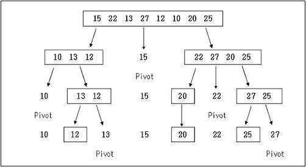

# R사 (2)
https://opentutorials.org/module/2870/16969
## 자신의 장점과 단점
## 요즘 기술 트렌드 학습하는 법
* 온오프믹스 세미나(ionic2, 진유림님), 밋업 모임(영어회화, nodejs), devFest등의 세미나, Facebook/google group(gdg, angular), 고수들 블로그나 github(아웃사이더, JakeWharton), 처음엔 고수들 블로그를 즐겨찾기해놓고 수시로 들어가서 봤는데 요즘은 topic중심으로 그때그때 찾아본다.
## 부서나 업무 롤의 분쟁이 일어났을 때 해결한 경험
* 분쟁이 일어났다는 이야기는 R&R이 불분명한 경우가 많다. R&R 관계를 잠시 제쳐두고, 업무자체의 목적과 지금 해결해야되는 사항에 대해서 고민한다. 그리고 서로서로 적절히 업무배분을 한다.
## 이직하려는 이유는? (중복)
## 이전 직장에서 맡았던 개발과 역할?
* 안드로이드 Wi-Fi Framework/Library 기능을 담당하면서 모델 출시를 위한 탑재 및 최적화, 이슈해결, 사업자 신규기능 구현, 홈로봇 서비스 제공 안드로이드 어플리케이션 개발, Angularjs를 이용한 IoT 제품 연동 관리 하이브리드 앱.
## 배우고 싶은 기술은 어떤 것이 있나요?
* 서비스 구조 설계(디자인), 어플리케이션 최적화, 대량 Data 처리, RxJava,Kotlin등의 신규 기술 등
## wait / notifyall 관련 손코딩
```java
    public synchronized methodA() {
    while(조건만족하지 않으면) {
        try {
            wait();
        catch(InterruptedException e) {
        }
        ~~~
        this.notifyAll();
    }
```
> http://everysw.tistory.com/entry/notifyAll-%EA%B3%BC-wait-%EC%82%AC%EC%9A%A9%EC%8B%9C-%EC%A3%BC%EC%9D%98%EC%A0%90

> http://kiwi99.tistory.com/21

## quicksort 손코딩
```java
    int partition(int arr[], int left, int right) {
          int i = left, j = right;
          int pivot = arr[(left + right) / 2];
          int tmp;
          
          while (i <= j) {
                while (arr[i] < pivot) i++;
                while (arr[j] > pivot) j--;
                if (i <= j) {
                      tmp = arr[i];
                      arr[i] = arr[j];
                      arr[j] = tmp;
                      i++;
                      j--;
                }
          };
         
          return i;
    }
     
    void quickSort(int arr[], int left, int right) {
          int index = partition(arr, left, right);
          if (left < index - 1)
                quickSort(arr, left, index - 1);
          if (index < right)
                quickSort(arr, index, right);
    }
```
## quicksort 알고리즘 과정 그림으로 설명 (화이트보드)

> http://www.algolist.net/Algorithms/Sorting/Quicksort 

> https://www.nczonline.net/blog/2012/11/27/computer-science-in-javascript-quicksort/ 

## Circular List 와 일반 Linked List 구분하는 법은?
* Floyd's Cycle-Finding Algorithm
* 러너 기법이라고도하며, 속도가 다른 2개의 임시 Node를 가지고 list traversal하면 Circular일 경우 빠른 Node가 느린 Node를 따라잡도록 만드는 방법.
* 속도 O(n) 공간 O(1)
> http://egloos.zum.com/minjang/v/1687021

> http://egloos.zum.com/lefoot/v/5226985

## 즐겨쓰는 디자인패턴과 이유 (중복)
## GC 과정을 설명해주세요
* 객체가 생성되어 Young 영역에 위치(여기서 발생한 GC는 Minor GC)하고 Young 영역에서 살아남은 객체는 Old 영역으로 이동.(Major GC)
## GC 알고리즘을 설명해주세요
* Young 영역에서는 Eden 영역과 2개의 Survivor 영역으로 구성되며, 새로 생성한 대부분의 객체는 Eden 영역에 위치, Eden 영역에서 GC가 한 번 발생한 후 살아남은 객체는 Survivor 영역 중 하나로 이동.
    하나의 Survivor 영역이 가득 차게 되면 그 중에서 살아남은 객체를 다른 Survivor 영역으로 이동하고 가득 찼던 Survivor 영역은 비움.
    이 과정을 반복하다가 계속해서 살아남아 있는 객체는 Old 영역으로 이동.
* Old 영역의 알고리즘은 Serial GC, Parallel GC, Parallel Old GC, CMS GC, G1 GC 등이 있음.
> http://d2.naver.com/helloworld/1329

## Dalvik 에서 Art 로 바뀌면서 GC 알고리즘이 변경되었는데 어떻게 변경되었나요?
* mark sweep 단계를 병렬 프로세싱, short-lived 객체 정리를 위해서 신규 Collector 사용, 비트맵 같은 큰 primitive를 분리된 pool에 유지.
> https://willowtreeapps.com/ideas/the-android-runtime-the-butter-weve-all-been-waiting-for

## HashTable 을 구현한다면 어떻게 구현하실래요?
* key, value, hash function, add, remove, 충돌처리방식(Separate Chaning/Open Addressing), resizing
> http://bcho.tistory.com/1072

> http://hyeonstorage.tistory.com/265

## Hash 를 쓰는 이유는 무엇인가요?
* access time이 상수시간(검색이 빠름), 삽입/삭제 쉬움
## 아시는 Sort 알고리즘 모두 설명해주세요
* Bubble, Selection, Insertion, Quick, Radix, Merge, Heap
* Bubble : 0~n까지 두수를 비교하여 위치를 교환하는 방식으로 가장 큰 수를 고른 후, n번 반복하여 정렬하는 방식. O(n2)
* Selection : 0~n까지 탐색하여 가장 큰 수(또는 작은수)를 n번 선택하는 방식.  O(n2)
* Insertion : 정렬된 배열을 만들어가며, 원소를 하나씩 추가하여 적절한 위치에 삽입하는 방식. O(n2). 이미 정렬되어있을 경우 최고! O(n)
* Quick : 연속적인 분할에 의한 정렬. pivot을 중심으로 pivot보다 작은수와 큰수를 나누어가며logn번 반복하는 방식. O(nlogn). 피벗선택을 잘못할 경우 O(n2) 됨.
* Radix : 정수 자리수의 숫자를 기준으로 큐에 넣어서 순서대로 꺼내는 방식으로 정렬을 기준이되는 자리수를 바꿔가면서 정렬을 하는 알고리즘. O(kn)
* Merge : 원소 개수가 1 또는 0이 될 때까지 두 부분으로 자른 뒤 앞의원소부터 크기를 비교해 병합해 나가며 정렬하는 알고리즘. O(nlogn). 일반적으로 퀵정렬보다 느리고 메모리도 필요하지만,stable하다.
* Heap : 원소들을 전부 Heap(부모의 값이 항상 최소 or 최대 값인 완전 이진 트리)에 삽입 후,루트를 출력하고 힙에서 제거하는 동작을 반복. 항상 O(nlogn).
> https://namu.wiki/w/%EC%A0%95%EB%A0%AC%20%EC%95%8C%EA%B3%A0%EB%A6%AC%EC%A6%98
## JDK 의 Sort 는 어떻게 되어있나요?
* JDK 1.8 Arrays.sort() 에서는 내부적으로 Dual-Pivot QuickSort 을 사용.
> http://iloveulhj.github.io/posts/java/java-collection-sort.html
* Collections 클래스의 정렬은 속도가 비교적 빠르고 안정성이 보장되는 Merge Sort를 사용.
> http://movefast.tistory.com/80
## Merge Sort 와 Quick Sort 의 장단점 및 시간복잡도, 공간복잡도를 알려주세요
* merge는 stable but 추가 메모리 사용. quick은 pivot을 어떻게 잡느냐에 따라 더 빠를 수 있고, 최악 O(n2). 동일하게 분할정복을 사용하지만 퀵정렬은 분할과 동시에 pivot을 기준으로 정렬하기 때문에 분할이 끝난시점에 정렬이 끝나있다. 분할한 공간을 참조할 때 cpu 캐시의 히트율이 높아 일반적으로 Merge보다 빠름.
공간복잡도 : merge=N, quick=1
> https://dodo4513.github.io/2017/04/09/sort_2/

> http://hsp1116.tistory.com/33
## HashMap 사용 시 hashCode 및 equals 오버라이딩 시의 주의점 및 규약
## 자신이 생각하는 OOP 란 무엇인가?
* 객체지향 프로그래밍 이란 캡슐화, 상속, 다형성 을 이용하여 **코드 재사용을 증가**시키고,**유지보수를 감소**시키는 장점을 얻기 위해서 **객체들을 연결시켜 프로그래밍 하는 것** 입니다.
* Class를 구성하여 객체(Instance)를 생성하는 것을 기본으로 프로그램 로직을 실행하도록 지향하는 프로그래밍.
> http://vandbt.tistory.com/10
## 자바의 메모리 구조에 대해서 설명해주세요
* Method Area, Heap, Stack, PC Register,  Native Method Stack
> https://joesimong.blogspot.kr/2014/04/java.html

> http://gbsb.tistory.com/4

> http://re-build.tistory.com/2

## 프로세스 및 스레드에 대해서 설명해주세요 (중복)
## Singleton 패턴을 멀티스레드 환경에서 적용하는 3가지 방법에 대해서 설명해 주세요
* synchronized를 이용하면 해결되지만 비용이 비싼 측면이 있어 Double check synchronization을 사용하고, Holder 클래스를 통한 지연초기화 방법을 사용할 수 있습니다.
```java
public class YourObject {
    private static class Holder {
        private static final YourObject instance = new YourObject();
    }

    public static YourObject getInstance() {
        return Holder.instance;
    }
}
```
* enum을 이용한 singleton 구현도 가능 합니다.
```java
public enum Singleton {
    INSTANCE;
    public void myMethod(){  
    }
}

Singleton.INSTANCE.myMethod();
```
> https://stackoverflow.com/questions/11165852/java-singleton-and-synchronization

* interface 로컬변수는 무조건 public static final 이고 생략 가능하기 때문에, interface Holder를 이용해 아래와 같이 활용 가능하다.
```java
public class YourObject {
    interface Holder {
        YourObject instance = new YourObject();
    }
    public static YourObject getInstance() {
        return Holder.instance;
    }
}
```
> http://gangzzang.tistory.com/entry/Java-%EC%9D%B8%ED%84%B0%ED%8E%98%EC%9D%B4%EC%8A%A4interface

> https://blog.seotory.com/post/2016/03/java-singleton-pattern

> (고려해볼 사항) https://medium.com/@LIP/singleton%EA%B3%BC-%EC%8A%B5%EA%B4%80%EC%A0%81-%EB%8A%A6%EC%9D%80-%EC%B4%88%EA%B8%B0%ED%99%94-ca94771b398f

## 데드락 발생 조건에 대해서 설명해주세요
* 한 리소스에 여러 프로세스 중 한 프로세스가 리소스를 점유하고 있으면서 다른 프로세스가 가지고 있는 리소스를 기다리고, 그 리소스를 강제로 빼앗을 수 없으며, 이러한 자원 대기가 순환하고 있을때.
## 데드락 회피 방법 및 대응 방법에 대해서 설명해주세요
* 발생조건을 하나이상 제거, 교착 상태를 일으킨 프로세스를 종료하거나, 할당된 자원을 해제
> http://includestdio.tistory.com/12
## Java 멀티스레드 구현을 위해 고려할 수 있는 것을 모두 알려주세요
* 리소스 소비(스택 생성 및 문맥교환 오버헤드), 복잡성 증가, 데이터 불일치, 실행순서 예측 불가, 데드락
> http://fsd-jinss.tistory.com/82

> http://jangsalt.tistory.com/entry/Java-Multi-Thread

> http://blog.eomdev.com/java/2016/04/06/Multi-Thread.html (읽어볼것)

## Mutex와 Semaphore
> http://ninako21.tistory.com/500

## interface 와 abstract 의 차이 (중복)
## 오버로딩과 오버라이딩의 차이 (중복)
## 오버로딩이 제네릭에서 쓰일 때는 어떻게 사용되나요?
* 제네릭을 쓴다는 건 여러 변수타입에 대한 동일한 동작을 정의하겠다는 이야기인데 오버로딩을 쓴다는 것은 반대되는 행위로 보인다.
* 대신 제네릭을 쓰지만 매개변수의 갯수가 다른 오버로딩을 사용하는 것은 의미가 있을 것 같다.
> https://m.blog.naver.com/PostView.nhn?blogId=spdlqjdudghl&logNo=220861890940&proxyReferer=https%3A%2F%2Fwww.google.co.kr%2F

> http://aroundck.tistory.com/3161

## 컴파일 타임 오버라이딩 및 런타임 오버라이딩에 대해 설명해주세요
* 오버라이딩은 기본적으로 런타임 시간에 바인딩된다.
* 그러나 hiding이라고 부르는 static method 오버라이딩은 컴파일 타임에 결정된다.(JVM은 static method의 실제 객체를 찾는 작업을 하지 않는다.)
> http://ohgyun.com/242
## Java IPC?
* Linux에서 제공하는 소켓, Pipe 등
* Android 바인더
> http://d2.naver.com/helloworld/47656

> https://junyongs.wordpress.com/2014/01/19/process-%EA%B0%84-%ED%86%B5%EC%8B%A0-%EB%B0%A9%EB%B2%95-inter-process-communication-ipc/

## Java concurrent package 에 대해서 설명해주세요
## 어노테이션에 대해서 설명해주세요
어노테이션은 소스 코드에 메타데이터를 삽입하는 것이기 때문에 잘 이용하면 구독성 뿐 아니라 체계적인 소스 코드를 구성하는데 도움이 됩니다. 
쉽게 말해서 "이 속성을 어떤 용도로 사용할까, 이 클래스에게 어떤 역할을 줄까?"를 결정해서 붙여준다고 볼 수 있습니다.
> http://www.nextree.co.kr/p5864/
## Android 시스템 구조
> http://myembedded.tistory.com/entry/%EC%95%88%EB%93%9C%EB%A1%9C%EC%9D%B4%EB%93%9C-%EC%8B%9C%EC%8A%A4%ED%85%9C-%EA%B5%AC%EC%A1%B0
## Android APK 구조
> https://academy.realm.io/kr/posts/jon-reeve-reverse-engineering-is-not-just-for-hackers-android/
## 액티비티나 커스텀뷰로 할 수 있는데 프래그먼트를 쓰는 이유는?
* 하나의 액티비티에서 여러 view들의 전환을 쉽게 하고 각 view들의 자원을 공유할 수 있다.
## Handler / Thread / Looper (중복)
## 백그라운드로 UI 를 업데이트하는 방법을 모두 알려주세요 (중복)
* Thread로 작업 후 runOnUIThread, View클래스 post메소드, Handler / AsyncTask
> http://openeg.co.kr/m/247
## 인텐트와 인텐트 필터의 개념을 알려주세요
* Intent는 일종의 메시지 객체입니다. 이것을 사용해 다른 앱 구성 요소로부터 작업을 요청할 수 있습니다. Activity 실행, Service 실행, Broadcast 전달.
* 명시적 인텐트 / 암시적 인텐트
* 인텐트 필터는 특정 인텐트를 받을지 말지를 정의하는 역할을 수행
> https://kairo96.gitbooks.io/android/content/ch2.8.html
## 이미지 안드로이드 라이브러리를 무엇을 사용해보았나요?
* Picasso, Glide
## 해당 라이브러리를 사용하는 이유는 무엇인가요?
* 이미지 로드 및 변환이 편하고 cache 신경쓰지 않아도됨.
* Glide는 gif를 지원.
> http://gun0912.tistory.com/19
## RxJava 란 무엇인가요
* 끊임없이 요청/변경되는 데이터에 반응하기 위해 나온 Reactive Programming 은 데이터를 처리함에 있어서 비동기적으로 데이터를 처리할 때 효율적으로 할 수 있도록 나온 방법.
> https://www.gitbook.com/book/zerobrain/what-is-rxjava-in-korean/details

> https://medium.com/@LIP/rxjava-29cfb3ceb4ca

## 안드로이드에서 멀티스레드 구현을 위해 고려할 수 있는 것을 모두 적어주세요
## 벡터 이미지 장점 및 사용 방법
## onPause / onStop 의 차이점
## 프래그먼트 생명주기를 액티비티와 비교해서 설명
## 서비스에서 startService 와 bindService 를 사용하는데, bindService 를 쓰는 경우는 언제인가요?
* Service와 지속적으로 interation해야 할 때.
## Kotlin 의 특징에 대해서 알려주세요
## Dalvik 과 Art 의 차이에 대해서 알려주세요
## NDK 의 개념
## Weak Reference / Soft Reference / Strong Reference 자세히 설명 및 GC 과정
* Soft Reference = 메모리가 부족할 때 GC 대상이 됨.
* Weak Refernece = GC 수행할 때마다 GC 대상이 됨.
> http://d2.naver.com/helloworld/329631

## ListView 와 RecyclerView 차이점 및 ViewHolder 를 ListView 에서 구현할 경- RecyclerView 와 성능차이가 있는지 여부
## HTTP 통신 구현 경험